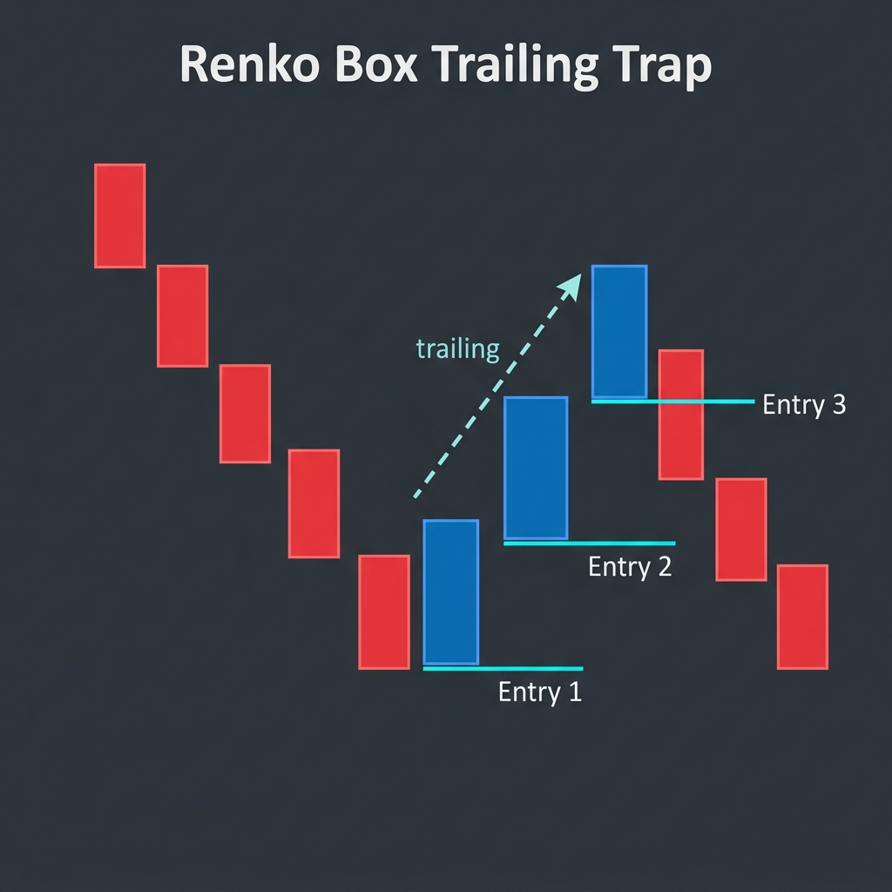

# Renko Box Trading - Strategy Specification

## Overview
The "Renko Box Trader" is a semi-automated trading system designed to trap trend resumptions after high-probability pullbacks. It focuses on the "Box" visual of Renko bricks, identifying moments where a counter-trend move (pullback) has failed and the primary trend is exploding into its next leg.

## Human-Software Interface (HSI)
The strategy is "Armed" by the trader using precise chart interactions:
- **Ctrl + Left Click**: Arms the "Reversal Trap." The software then enters **STALKING mode**, waiting persistently for a counter-trend pullback (reversal) regardless of how far the current trend runs.
- **Shift + Left Click**: Immediate "Flatten" (Liquidate all positions and cancel all pending orders).

## Stalking & Visual Feedback
- **STALKING TREND**: Displayed when the trap is armed but the market is still moving in the primary direction (e.g., Red bricks in a downtrend). The software follows the trend's leading edge without placing orders.
- **BOX TRAP ACTIVE**: Displayed as soon as the **first counter-trend brick** (the hinge) completes. This is when the initial trailing stop order is placed.

## Entry Execution Logic (Trailing Pullback Trap)

The strategy uses an active "Trailing Entry" system. When a pullback begins, the software places a stop order and then manually "trails" it deeper into the pullback for a fixed duration.

### 1. Trend Resumption (Short Entry)
- **Setup Pattern**: Market is trending lower (Red bricks), followed by a counter-trend "Pullback" (1-3 Blue bricks).
- **Rule**: Upon completion of **Blue Brick #1**, a Sell Stop is placed at the **Low (Open)** of that brick.
- **Trailing Action**: If the market continues to rise (forming Blue Bricks #2 and #3), the Sell Stop is trailed **UP** to the Low (Open) of the most recent Blue brick.
- **Safety Kill**: If a **fourth Blue brick** completes, the pullback is considered too deep (a potential trend reversal), and the entry order is **automatically cancelled**.

### 2. Trend Resumption (Long Entry)
- **Setup Pattern**: Market is trending higher (Blue bricks), followed by a counter-trend "Pullback" (1-3 Red bricks).
- **Rule**: Upon completion of **Red Brick #1**, a Buy Stop is placed at the **High (Open)** of that brick.
- **Trailing Action**: If the market continues to fall (forming Red Bricks #2 and #3), the Buy Stop is trailed **DOWN** to the High (Open) of the most recent Red brick.
- **Safety Kill**: If a **fourth Red brick** completes, the pullback is considered too deep, and the entry order is **automatically cancelled**.

## Auto-Position Sizing
The strategy features an **"Auto-Detect"** mode for Brick Scaling:
- **Trigger**: If the `BarSize` input is set to **0**, the software goes into Auto-Mode.
- **Mechanism**: During `StartCalc`, it measures the actual vertical distance between `Bars.High[0]` and `Bars.Low[0]`.
- **Scaling**: All entry offsets, risk calculations, and stop placements are dynamically adjusted based on this measured `m_BrickSize`.

## Core Configuration
- **Fast EMA (5)**: Used for internal trend alignment.
- **Slow EMA (15)**: Primary structural "Value" line.
- **Master EMA (60)**: Master trend filter (The "Engine").

## Future Refinements
- **Stop-Loss Logic**: Should the stop-loss align with the opposite side of the "Box" (The High of the Blue brick for a short)?
- **Profit Targets**: Fixed multiplicity of the `m_BrickSize` (e.g., Target = 3 Bricks).
- **Volume Energy Filter**: Should we only "Arm" the trap if the pullback shows "Exhaustion" volume?
